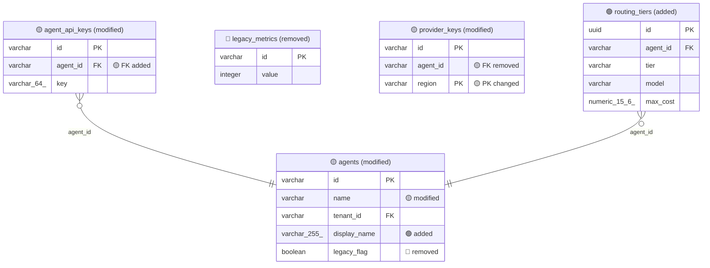

<!-- db-diagram-bot -->
## Database schema changes

**Migrations in this PR:**
- `1779000000000-AddRoutingTiers.ts`
- `1779100000000-RefactorAgents.ts`
- `1779200000000-DropLegacyMetrics.ts`
- `1779300000000-RekeyProviderKeys.ts`

### Summary
- 🟢 **Added tables:** `routing_tiers`
- 🟡 **Modified tables:** `agent_api_keys` (+1 FK), `agents` (+1 col, ~1 col, -1 col), `provider_keys` (-1 FK, PK changed)
- 🔴 **Removed tables:** `legacy_metrics`

### Schema diagram

Showing only changed tables. 🟢 added, 🟡 modified, 🔴 removed. Changed columns are annotated inline.

Detailed column-level changes

#### 🟢 `routing_tiers` _(new table)_
- `id` `uuid` NOT NULL **PK**
- `agent_id` `varchar` NOT NULL
- `tier` `varchar` NOT NULL
- `model` `varchar` NOT NULL
- `max_cost` `numeric(15,6)` NULL

#### 🟡 `agent_api_keys`
- 🔗 added FK `agent_id` → `agents.id`

#### 🟡 `agents`
- 🔄 modified `name`: `varchar` NOT NULL → `varchar` NULL
- ➕ added `display_name` `varchar(255)` NULL
- ➖ dropped `legacy_flag` _(was `boolean`)_

#### 🟡 `provider_keys`
- 🔑 primary key changed: + `region`
- 🔗 dropped FK `agent_id` → `agents.id`

#### 🔴 `legacy_metrics` _(removed)_

---
Generated by the <code>db-diagram</code> workflow • only tables with schema changes are shown.
