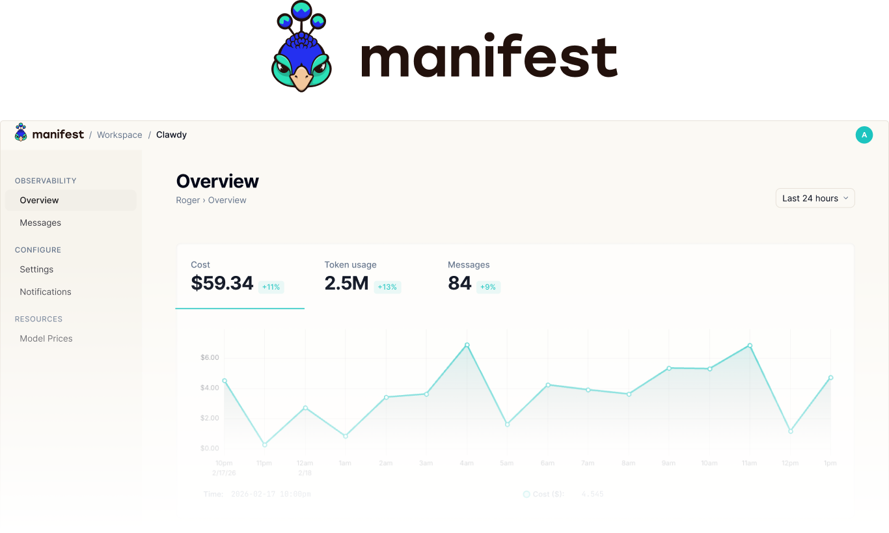

<p align="center">
  
</p>

<h1 align="center">Manifest</h1>

<p align="center">
  Open-source observability for AI agents.<br />
  Track costs, tokens, messages, and performance — entirely on your machine.
</p>

<p align="center">
  <a href="https://www.npmjs.com/package/manifest"></a>
  &nbsp;
  <a href="https://www.npmjs.com/package/manifest"></a>
  &nbsp;
  <a href="https://codecov.io/gh/mnfst/manifest"></a>
  &nbsp;
  <a href="LICENSE"></a>
</p>

<p align="center">
  <a href="#install">Install</a> &nbsp;&middot;&nbsp;
  <a href="#what-you-get">What you get</a> &nbsp;&middot;&nbsp;
  <a href="#tech-stack">Tech stack</a> &nbsp;&middot;&nbsp;
  <a href="#connecting-telemetry">Telemetry</a> &nbsp;&middot;&nbsp;
  <a href="#configuration">Configuration</a> &nbsp;&middot;&nbsp;
  <a href="#contributing">Contributing</a>
</p>

---

> **Want a hosted version instead?** [app.manifest.build](https://app.manifest.build) is a free cloud instance — install the plugin, paste your API key, and you're done in 30 seconds. No server to run.

---

## Install

Manifest runs as an embedded server inside the [OpenClaw](https://openclaw.com) plugin. Two commands, no Docker, no Postgres, no env files.

```bash
openclaw plugins install manifest
openclaw config set plugins.entries.manifest.config.mode "local"
```

Restart the gateway and you're up:

```bash
openclaw gateway restart
```

The dashboard opens at **http://127.0.0.1:2099**. Telemetry from your agent flows in automatically.

### What happens under the hood

1. The plugin generates a local API key and stores it in `~/.openclaw/manifest/config.json`
2. An embedded NestJS server starts with a SQLite database at `~/.openclaw/manifest/manifest.db`
3. OpenTelemetry traces and metrics are piped to the local OTLP endpoint
4. Model pricing is seeded on first boot and refreshed from OpenRouter on each startup

No account, no signup, no external network calls for telemetry. Everything stays on your machine.

## What you get

- **Real-time dashboard** — tokens, costs, messages, and model usage with interactive charts
- **Per-agent breakdown** — track multiple agents independently with sparkline overviews
- **Cost tracking** — automatic cost calculation using up-to-date model pricing (28+ models)
- **Message log** — paginated history of every agent message with token counts
- **Security events** — monitor for prompt injection attempts and anomalous patterns
- **Notification rules** — set threshold alerts on token or cost usage per period
- **OTLP-native** — standard OpenTelemetry ingestion (traces, metrics, logs) via HTTP

## Tech Stack

| Layer     | Technology                                |
| --------- | ----------------------------------------- |
| Frontend  | SolidJS, uPlot, custom CSS theme          |
| Backend   | NestJS 11, TypeORM, SQLite (local mode)   |
| Auth      | Better Auth (auto-login on localhost)      |
| Telemetry | OTLP HTTP (JSON + Protobuf)               |
| Build     | Turborepo + npm workspaces                |

The full NestJS + SolidJS stack runs locally backed by SQLite. The same codebase also powers the [cloud version](https://app.manifest.build) with PostgreSQL — the only differences are the database driver and auth guard.

## Connecting Telemetry

### Automatic (OpenClaw plugin)

If you installed Manifest via the OpenClaw plugin, telemetry is wired up automatically. Every agent conversation generates traces and metrics without any extra configuration.

### Manual (any OpenTelemetry SDK)

Manifest accepts standard OTLP HTTP signals. Point any exporter at your local instance:

| Signal  | Endpoint                              | Auth                                    |
| ------- | ------------------------------------- | --------------------------------------- |
| Traces  | `POST http://127.0.0.1:2099/otlp/v1/traces`  | `Authorization: Bearer <your-api-key>` |
| Metrics | `POST http://127.0.0.1:2099/otlp/v1/metrics` | `Authorization: Bearer <your-api-key>` |
| Logs    | `POST http://127.0.0.1:2099/otlp/v1/logs`    | `Authorization: Bearer <your-api-key>` |

Your API key is in `~/.openclaw/manifest/config.json`. Both `application/json` and `application/x-protobuf` are supported.

#### Node.js / TypeScript

```typescript
import { NodeSDK } from '@opentelemetry/sdk-node'
import { OTLPTraceExporter } from '@opentelemetry/exporter-trace-otlp-http'

const sdk = new NodeSDK({
  traceExporter: new OTLPTraceExporter({
    url: 'http://127.0.0.1:2099/otlp/v1/traces',
    headers: { Authorization: 'Bearer mnfst_your-api-key' },
  }),
  serviceName: 'my-agent',
})

sdk.start()
```

#### Python

```python
from opentelemetry.sdk.trace import TracerProvider
from opentelemetry.sdk.trace.export import BatchSpanProcessor
from opentelemetry.exporter.otlp.proto.http.trace_exporter import OTLPSpanExporter

provider = TracerProvider()
provider.add_span_processor(BatchSpanProcessor(OTLPSpanExporter(
    endpoint="http://127.0.0.1:2099/otlp/v1/traces",
    headers={"Authorization": "Bearer mnfst_your-api-key"},
)))
```

### Semantic Conventions

Manifest classifies spans using these OpenTelemetry attributes:

| Attribute                    | Purpose                           |
| ---------------------------- | --------------------------------- |
| `agent.name`                 | Groups data per agent             |
| `gen_ai.system`              | Identifies LLM API calls          |
| `gen_ai.request.model`       | Tracks which model was used       |
| `gen_ai.usage.input_tokens`  | Token usage tracking              |
| `gen_ai.usage.output_tokens` | Token usage tracking              |
| `tool.name`                  | Identifies tool call spans        |
| `session.key`                | Groups messages by session        |

## Configuration

The plugin config lives in your OpenClaw settings. All fields are optional in local mode.

| Setting | Default | Description |
| --- | --- | --- |
| `mode` | `"cloud"` | Set to `"local"` for the self-hosted server |
| `port` | `2099` | Dashboard and OTLP port |
| `host` | `"127.0.0.1"` | Bind address |

```bash
# Change the port
openclaw config set plugins.entries.manifest.config.port 8080

# Bind to all interfaces (access from other machines)
openclaw config set plugins.entries.manifest.config.host "0.0.0.0"
```

### Data location

| Path | Contents |
| --- | --- |
| `~/.openclaw/manifest/manifest.db` | SQLite database (all telemetry data) |
| `~/.openclaw/manifest/config.json` | Auto-generated API key |

To reset everything, delete `~/.openclaw/manifest/` and restart the gateway.

## Contributing

Manifest is open source under the [MIT license](LICENSE). Contributions are welcome.

### Prerequisites

- Node.js 22.x
- npm 10.x

### Setup

```bash
git clone https://github.com/mnfst/manifest && cd manifest
npm install
```

### Development

Run the backend and frontend separately in dev mode:

```bash
# Backend (needs a .env — see packages/backend/.env.example)
cd packages/backend && NODE_OPTIONS='-r dotenv/config' npx nest start --watch

# Frontend (proxies API to backend on :3001)
cd packages/frontend && npx vite
```

For local mode development without PostgreSQL:

```bash
MANIFEST_MODE=local MANIFEST_DB_PATH=./dev.db BETTER_AUTH_SECRET=$(openssl rand -hex 32) \
  node packages/backend/dist/main.js
```

### Testing

```bash
npm test --workspace=packages/backend          # 378 unit tests
npm run test:e2e --workspace=packages/backend  # 45 e2e tests
npm test --workspace=packages/frontend         # 82 frontend tests
npm test --workspace=packages/openclaw-plugin  # 116 plugin tests
```

### Project structure

```
packages/
  backend/           NestJS API + OTLP ingestion + analytics
  frontend/          SolidJS dashboard
  openclaw-plugin/   OpenClaw plugin (cloud + local mode)
  manifest-server/   Embedded server wrapper for local mode
```

## License

[MIT](LICENSE)
