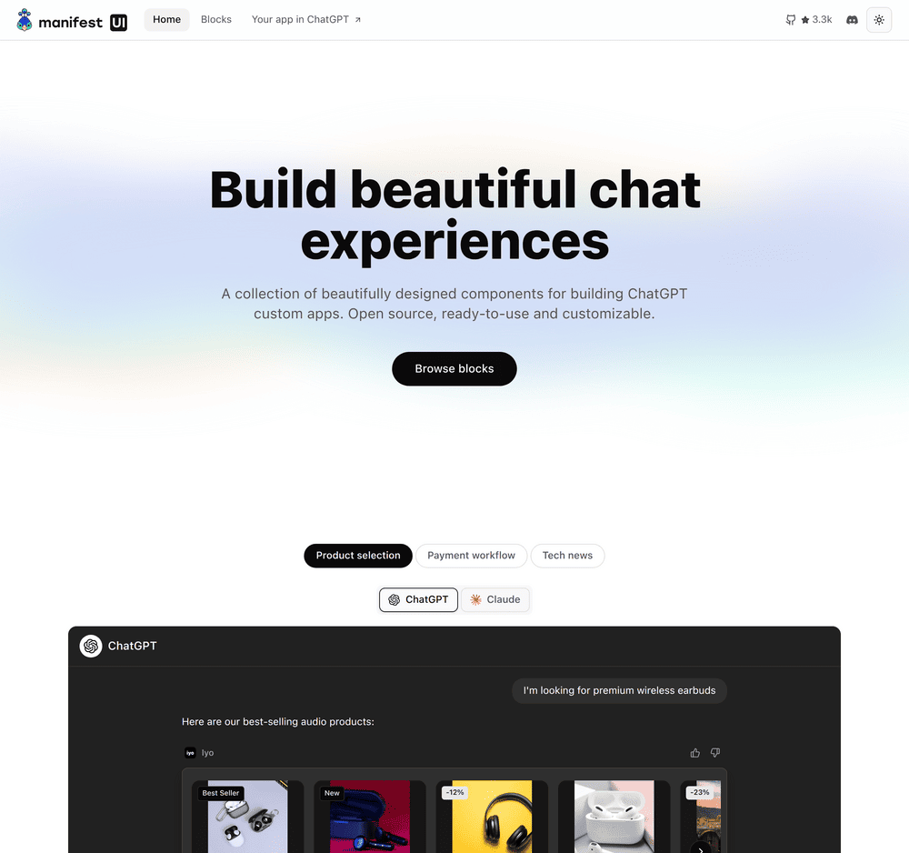

<p align="center">
  <a href="https://manifest.build/#gh-light-mode-only">
    
  </a>
  <a href="https://manifest.build/#gh-dark-mode-only">
    
  </a>
</p>

> [!WARNING]
> Looking for the Manifest 1-file backend? See [this repo](https://github.com/mnfst/manifest-baas) instead.

---

<p align='center'>
<strong>Shadcn/ui components library for building ChatGPT Apps
</strong>
<br><br>  
  <a href="https://www.npmjs.com/package/manifest" target="_blank"></a>
  <a href="https://www.npmjs.com/package/manifest" target="_blank"></a>
  <a href="https://www.codefactor.io/repository/github/mnfst/manifest" target="_blank"></a>
  <a href="https://github.com/mnfst/manifest/blob/master/.github/workflows/ci-cd.yml"></a>
  <a href="https://discord.com/invite/FepAked3W7" target="_blank"></a>
  <a href="https://opencollective.com/mnfst"  target="_blank"></a>
  <a href="https://codecov.io/gh/mnfst/manifest" ></a>
  <a href="https://github.com/mnfst/manifest/blob/develop/LICENSE" target="_blank"></a>
  <a href="https://www.jsdelivr.com/package/npm/manifest" target="_blank"></a>
<br>

<p align="center">
  <a href="https://ui.manifest.build/">
    
  </a>
</p>

## Why Manifest?

Manifest helps developers create their agentic applications like ChatGPT or MCP Apps by giving them a set of components made for this format.

Each block and component is a production-ready asset that you can customize and extend to adapt to your project.

All elements are Open source and hosted in this repository.

## Getting started

Make sure you have shadcn/ui installed in your project and install [a block](https://ui.manifest.build/blocks) with your CLI:

```bash
# Using npx
npx shadcn@latest add @manifest/table
```

## Community & Resources

- [Chat with us](https://discord.gg/FepAked3W7) on our Discord
- [Report bugs](https://github.com/mnfst/manifest/issues) on GitHub issues
- [Suggest new features](https://github.com/mnfst/manifest/discussions/new?category=feature-request) on GitHub Discussions

## Want to help Manifest grow? 💗

Here is a few small things you can do:

- Star the [Manifest repository](https://github.com/mnfst/manifest)
- Give us your feedback on [Discord](https://discord.gg/FepAked3W7)
- Sponsor Manifest through [Github](https://github.com/sponsors/mnfst)

## Contributors

We welcome contributions to Manifest, Please see our [Contributing Guidelines](./CONTRIBUTING.md) to get started and join the journey.

Thanks to our wonderful contributors!

<a href="https://github.com/mnfst/manifest/graphs/contributors">
  
</a>

## Sponsors

Manifest is an MIT-licensed open-source project. If you find it useful and want to support its development, consider [becoming a sponsor](https://opencollective.com/mnfst).

<h3 align="center">Sponsors</h3>

[](https://opencollective.com/mnfst)

<h3 align="center">Backed by</h3>


<h3 align="center">Partners</h3>
<div align="center" style="display:flex; width:100%; flex-wrap:wrap; align-items: center; justify-content: space-between">
<br>

<table>
  <tr>
    <td>
      <a href="https://kreezalid.com/" target="_blank">
        
      </a>
    </td>
    <td>
      <a href="https://rise.work/" target="_blank">
        
      </a>
    </td>
    <td>
      <a href="https://feature.sh/" target="_blank">
        
      </a>
    </td>
    <td>
      <a href="https://www.lambdatest.com/" target="_blank">
        
      </a>
    </td>
  </tr>
</table>

This project is tested with BrowserStack

</div>
