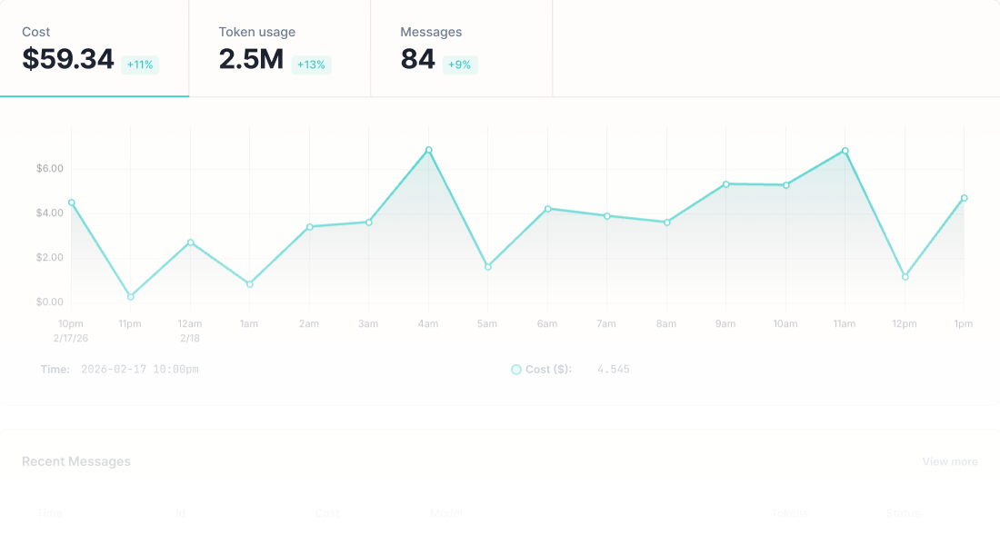

<p align="center">
  <picture>
    <source media="(prefers-color-scheme: dark)" srcset=".github/assets/logo-white.svg" />
    <source media="(prefers-color-scheme: light)" srcset=".github/assets/logo-dark.svg" />
    
  </picture>
</p>
<p align="center">
    🦞 Take control of your
OpenClaw costs
</p>
<p align="center">
  <a href="https://app.manifest.build">
    <picture>
      <source media="(prefers-color-scheme: dark)" srcset=".github/assets/home-gh-dark.png" />
      <source media="(prefers-color-scheme: light)" srcset=".github/assets/home-gh-light.png" />
      
    </picture>
  </a>
</p>

<p align="center">
  <a href="https://github.com/mnfst/manifest/stargazers"></a>
  &nbsp;
  <a href="https://www.npmjs.com/package/manifest"></a>
  &nbsp;
  <a href="https://www.npmjs.com/package/manifest"></a>
  &nbsp;
  <a href="https://github.com/mnfst/manifest/actions/workflows/ci.yml"></a>
  &nbsp;
  <a href="LICENSE"></a>
  &nbsp;
  <a href="https://discord.gg/FepAked3W7"></a>
</p>

## What do you get?

- 🔀 **Routes every request to the right model** — and cuts costs up to 90%
- 📊 **Track your expenses** — real-time dashboard that shows tokens and costs
- 🔔 **Get notified** — set up alerts if your consumption exceeds a certain volume

## Why Manifest

OpenClaw sends all your requests to the same model, which is not cost-effective since you summon big models for tiny tasks. Manifest solves it by redirecting queries to the most cost-effective model.

Manifest is an OpenClaw plugin that intercepts your query, passes it through a 23-dimension scoring algorithm in <2ms and sends it to the most suitable model.

Unlike almost all alternatives, everything stays on your machine. No suspicious installer, no black box, no third party, no crypto.

## Quick Start

```bash
openclaw plugins install manifest
openclaw gateway restart
```

Dashboard opens at **http://127.0.0.1:2099**. Telemetry from your agents flows in automatically.

## Features

- **LLM Router** — scores each query and calls the most suitable model
- **Real-time dashboard** — tokens, costs, messages, and model usage at a glance
- **No coding required** — Simple install as OpenClaw plugin
- **OTLP-native** — standard OpenTelemetry ingestion (traces, metrics, logs)

## Manifest vs OpenRouter

|              | Manifest                                                   | OpenRouter                                                    |
| ------------ | ---------------------------------------------------------- | ------------------------------------------------------------- |
| Architecture | Runs locally — data stays on your machine                  | Cloud proxy — all traffic routes through their servers        |
| Cost         | Free                                                       | 5% fee on every API call                                      |
| Source code  | MIT licensed, fully open                                   | Proprietary                                                   |
| Data privacy | 100% local routing and logging                    | Your prompts and responses pass through a third party         |
| Transparency | Open scoring algorithm — see exactly why a model is chosen | Black box routing, no visibility into how models are selected |

## Privacy

**Your data stays on your machine.** All agent messages, token counts, costs, and telemetry are stored locally. None of this data is ever sent to us or any third party.

Manifest collects anonymous product analytics (hashed machine ID, OS platform, package version, event names) to help improve the project. No personally identifiable information or agent data is included.

**Opting out:**

```bash
MANIFEST_TELEMETRY_OPTOUT=1
```

Or add `"telemetryOptOut": true` to `~/.openclaw/manifest/config.json`.

## Contributing

Manifest is open source under the [MIT license](LICENSE). Contributions are welcome.

**Prerequisites:** Node.js 22.x, npm 10.x

```bash
git clone https://github.com/mnfst/manifest && cd manifest
npm install
```

See [CONTRIBUTING.md](CONTRIBUTING.md) for the full development setup, architecture notes, and workflow.

Join the conversation on [Discord](https://discord.gg/FepAked3W7).

> **Want a hosted version instead?** Check out our cloud version at [app.manifest.build](https://app.manifest.build)

## License

[MIT](LICENSE)
