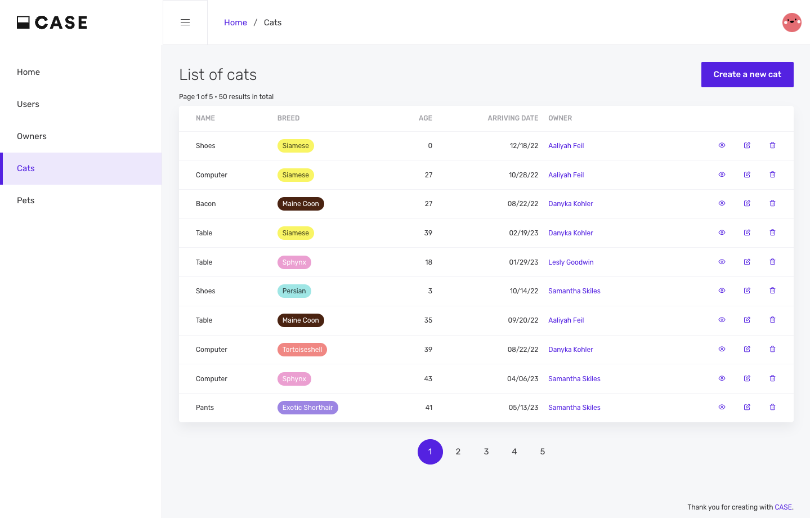

<p align="center">
  <a href="https://www.case.app">
    
  </a>
</p>

<h3 align='center' style="margin-bottom:30px">The fastest and easiest way to develop CRUD apps</h3>


## Why CASE ?

- 🧠 **Focus on your data, not on your framework(s)**. Data-oriented approach, no need to learn new stuff
- ⚡ **Ultra-fast development**. 1 command install, simple and effective codebase
- ✨ **Beautiful and clear UI**. Professional quality interface, designed with end-users

## Getting started

1. **Requirements**

   [NodeJS](https://nodejs.org/en) (v14 or ulterior).

2. **Install CASE**

   ```sh
   npx create-case-app my-case-app
   ```

3. **Start the application**

   ```sh
   cd my-case-app
   npm start
   ```

   Voilà ! Your application is accessible at http://localhost:3000.

   The API is accessible at http://localhost:3000/api.

## Learn more

- [CASE documentation](https://docs.case.app/) - Official CASE documentation

## Community

- [Discord](https://discord.gg/FepAked3W7) - Come chat with the CASE community
- [Dev.to](https://dev.to/casejs) - Stay tuned to CASE developments
- [Github](https://github.com/casejs/case/issues) - Report bugs and share ideas to improve the product.
