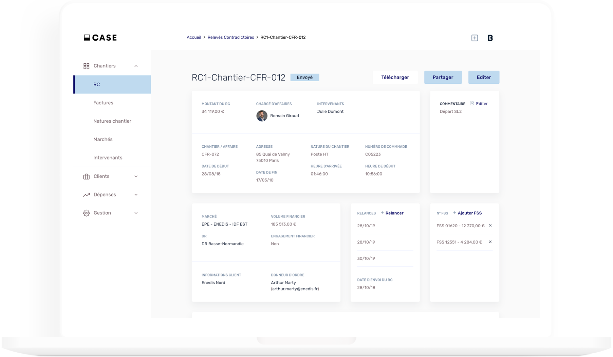

# CASE Documentation

As a lot of our fellows developers, we have faced the fact that coding web apps with relations take a bunch of time doing basically the same repetitive tasks...

Changing slow into fast and lame into cool we create CASE ! 👊

CASE is an open-source JS framework that **helps you to build easily marvelous custom web apps with relations** !

We are using some other cool technologies as packages to work :

- The **simplicity** of [Angular Schematics](https://blog.angular.io/schematics-an-introduction-dc1dfbc2a2b2) to create useable resource in one command.
- The **transparency** of [Typescript](https://www.typescriptlang.org/docs/) to know better while coding and be tooled quick.
- The **cleverness** of [TypeORM](https://typeorm.io/#/) to interact with SQL Database **without** using SQL language !
- The **rapidity** of [Faker.JS](https://github.com/marak/Faker.js/) to create highly realistic dummy data while developing.

> You don't need to know all these technologies to build your project with CASE but you can check their docs, we will refer to you whenever their use is necessary.

#### CASE is an open-source project, feel free to participate to it or give us feedbacks !
