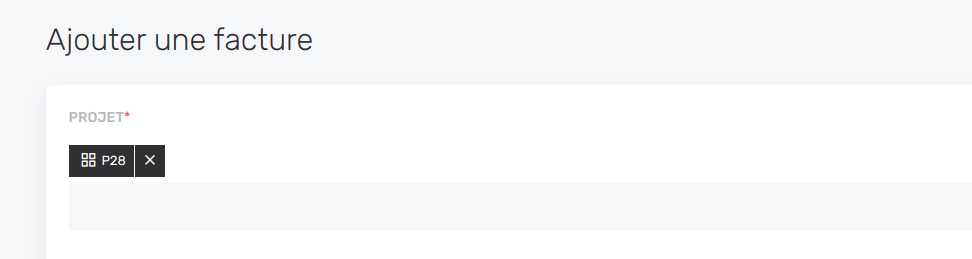

# Create-edit view

The Create Edit view is the view that contains the form to create a new resource or to update an existing one.

You can see the **dropdownLinks** in the **viewList** of your resource being displayed as follow


If you want to modify the drop down links you can go on the resource.definition.ts :

```js
//customer.definition.ts
dropdownLinks: [
  {
    label: 'Modifier',
    permission: 'editCustomers',
    action: (customer) => ({
      type: ActionType.Link,
      link: {
        path: `${customerDefinition.path}/${customer.id}/edit`
      }
    })
  },
  {
    label: 'Supprimer',
    permission: 'deleteCustomers',
    action: (customer) => ({
      type: ActionType.Delete,
      delete: {
        itemToDelete: customer,
        definition: customerDefinition
      }
    })
  }
]
```


You can modify the fields that appears on the create-edit views on the resource-create-edit.component.ts

```js
//customer-create-edit.component.ts

import { Component, OnInit } from '@angular/core';
import { ActivatedRoute, Router } from '@angular/router';
import { FormBuilder } from '@angular/forms';

import {
  CaseCreateEditComponent,
  ResourceDefinition,
  Field,
  Filter,
  InputType,
  BreadcrumbService,
  FlashMessageService,
  ResourceService,
  caseCreateEditTemplate,
} from 'case';

import { customerDefinition } from '../customer.definition';

@Component({ template: caseCreateEditTemplate })
export class CustomerCreateEditComponent
  extends CaseCreateEditComponent
  implements OnInit
{
  definition: ResourceDefinition = customerDefinition;
  fields: Field[] = [
    {
      label: 'Customer name',
      placeholder: 'Enter the customer name...',
      property: 'name',
      inputType: InputType.Text,
      required: true,
    },
    {
      label: 'Billing Email',
      placeholder: 'Enter the customer billing email...',
      property: 'billingEmail',
      inputType: InputType.Text,
      required: true,
    },
    {
      label: 'Address',
      placeholder: 'Enter the customer address...',
      property: 'address',
      inputType: InputType.Text,
    },
    {
      label: 'Billing Address',
      placeholder: 'Enter the customer billing address...',
      property: 'billingAddress',
      inputType: InputType.Text,
      required: true,
    },
    {
      label: 'Account manager',
      properties: {
        value: 'accountManagerId',
      },
      retrievedItemProperties: {
        accountManagerId: 'accountManager.id',
      },
      required: true,
      inputType: InputType.Select,
      selectOptions: () =>
        this.customResourceService.listSelectOptions('users'),
    },
  ];

  constructor(
    formBuilder: FormBuilder,
    router: Router,
    activatedRoute: ActivatedRoute,
    resourceService: ResourceService,
    breadcrumbService: BreadcrumbService,
    flashMessageService: FlashMessageService,
    private customResourceService: ResourceService
  ) {
    super(
      formBuilder,
      router,
      breadcrumbService,
      resourceService,
      flashMessageService,
      activatedRoute
    );
  }

  ngOnInit() {
    this.initCreateEditView();
  }
}

```

You have to specify the object you use by the DTO to manage this object in the client directory and in the server one

```js
// create-update-customer.dto.ts

import { IsNotEmpty, IsOptional, IsString } from "class-validator";

export class CreateUpdateCustomerDto {
  @IsNotEmpty()
  @IsString()
  readonly name: string;

  @IsNotEmpty()
  @IsString()
  readonly billingEmail: string;

  @IsNotEmpty()
  @IsString()
  readonly billingAddress: string;

  @IsOptional()
  @IsString()
  readonly address: string;

  @IsNotEmpty()
  readonly accountManagerId: number;
}

```

- Relations

To modify a field of a relation you have to retrieved the item properties like so and use the **customResourceService** to call the list of the related resource.

```js
//customer-create-edit.component.ts
{
      label: 'Account manager',
      properties: {
        value: 'accountManagerId',
      },
      retrievedItemProperties: {
        accountManagerId: 'accountManager.id',
      },
      required: true,
      inputType: InputType.Select,
      selectOptions: () =>
        this.customResourceService.listSelectOptions('users'),
    },
```

You'll also have to allow the link of the related resource to the current resource through the **store**, **update** and **show** functions of your current resource service.

```js
//customer.service.ts
 async show(id: string): Promise<Customer> {
    const customer = await this.repository
      .createQueryBuilder("customer")
      .leftJoinAndSelect("customer.accountManager", "accountManager")

      .where("customer.id = :id", {
        id,
      })
      .getOne();

    if (!customer) {
      throw new NotFoundException();
    }

    return customer;
  }

  async store(customerDto: CreateUpdateCustomerDto): Promise<Customer> {
    const customer: Customer = this.repository.create(customerDto);
    customer.accountManager = await this.entityManager.findOneOrFail(
      User,
      customerDto.accountManagerId
    );
    return this.repository.save(customer);
  }

  async update(
    id: string,
    customerDto: CreateUpdateCustomerDto
  ): Promise<UpdateResult> {
    const customer: Customer = this.repository.create(customerDto);
    customer.accountManager = await this.entityManager.findOneOrFail(
      User,
      customerDto.accountManagerId
    );
    return this.repository.update(id, customer);
  }
```

You can choose what properties is display on the related resource controller

```js
//user.controller.ts

 @Get('select-options')
  @UseGuards(AuthGuard)
  async listSelectOptions(
    @Query('roleName') roleName?: string,
    @Query('orderBy') orderBy?: string,
    @Query('orderByDesc') orderByDesc?: string
  ): Promise<SelectOption[]> {
    const users: User[] = (await this.userService.index({
      roleName,
      withoutPagination: true,
      orderBy,
      orderByDesc
    })) as User[]

    return users.map((user: User) => ({
      label: user.name,
      value: user.id
    }))
  }
```

- Front-end

On create-edit views, the form to edit the resource will be generated from a list of **Fields** that you can manage.

You can add them in the `fields` property of your create-edit component :

```js
//customer-create-edit.component.ts
import { InputType } from 'case'

// Generates a text field with label "Contact name".
fields: Field[] = [
{
    label: 'Contact name',
    placeholder: 'Enter contact name...',
    property: 'name',
    inputType: InputType.Text,
    required: true,
    className: 'my-custom-class'
}
]
```

## Validation

If a field is required, set the `required` prop to `true`.

If you need custom validators, you can pass an array of [Angular ValidatorFn](https://angular.io/api/forms/Validators) to the field :

```js
//customer-create-edit.component.ts
{
  label: 'Email',
  property: 'password',
  inputType: InputType.Email,
  validators: [Validators.required, Validators.email]
}
```

Or use a distinct set of validators for "create" and "edit" mode :

```js
//customer-create-edit.component.ts
{
  label: 'Password',
  property: 'password',
  inputType: InputType.Password,
  createValidators: [Validators.required],
  editValidators: []
},
```

## Suggest or force a value

You can suggest a value to the users, in order to make resource creation easier for them. The example below suggests today's date for the `creationDate` field :

```js
//customer-create-edit.component.ts
import * as moment from 'moment
[...]
{
  label: 'Date de création',
  property: 'issueDate',
  inputType: InputType.Datepicker,
  className: 'is-3',
  required: true,
  initialValue: {
    // The moment() function without argument refers as today.
    value: moment()
  }
},
```

You can also pass an async function for initial value. Below we are making an HTTP request to the server to suggest the value based on DB data.

```js
// invoice.create-edit.component.ts (client)
{
  label: 'Numéro de facture',
  property: 'number',
  inputType: InputType.Text,
  className: 'is-3',
  required: true,
  initialValue: () =>
    this.customResourceService
      .show('invoices', 'suggest-next-number')
      .toPromise()
      .then((res: { suggestedNumber: string }) => ({
        value: res.suggestedNumber
      }))
}

// invoice.controler.ts (server)
// You would need to implement an endpoint that should look like this.
@Get('/suggest-next-number')
@Permission('readInvoices')
async suggestNextNumber(): Promise<{ suggestedNumber: string }> {
  return this.invoiceService.suggestNextNumber()
}
```

Those examples are **suggesting** an initial value. It means that if we already have a value when we edit an existing resource (edit mode), the resource value **will not be replaced** by the suggestion. If you want to force that override anyway, you can use the `forcedValue` instead :

```js
//customer-create-edit.component.ts
{
  label: 'Montant (€ HT)',
  property: 'amount',
  inputType: InputType.Number,
  className: 'is-3',
  required: true,
  forcedValue: {
    value: 999
  }
}
```

## Special rules

Suggesting or force a value is nice, but sometimes you need to pre fill dynamically a value. In that case you can pass a **specialRules** query parameter to the link of the create-edit page.

Let's take an example where you want to add an invoice for an existing project. Instead of linking to the **invoice create-edit** page and forcing the user to fill again the project, you can pre fill it :

```js
//
createInvoiceForCurrentProjectSpecialRules = JSON.stringify([
  {
    fieldId: 'projectId',
    forcedValue: {
      value: this.project.id
    }
  }
])
```

And then pass it to the link:

```html
<a
  routerLink="/invoices/create"
  [queryParams]="{specialRules: createInvoiceForCurrentProjectSpecialRules}"
></a>
```

That will pre fill your **projectId** field



## Anchor link to a field

You can use **URL fragments** to link to a defined field of the create-edit page. Be sure to add an `id` property to the field in the create-edit page and report it in the `fragment` property of your link.

```html
<a routerLink="/create-edit" fragment="projectId"
  >Go to the project field of the create-edit page</a
>
```

## Adapt form on change

Comming soon (onChange() hook)...
