# Field types

The `inputType` property allows you to choose the type of input for your fields.

## Address

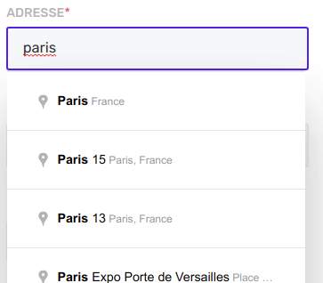

A Google Place autocomplete input where you can choose an address, locality, region, country and event and establishment.

```js
{
    label: 'Adress',
    property: 'address',
    inputType: InputType.Address
  }
```

> [!ATTENTION]
> Each CASE project needs to have its own Google Maps API Key. [Create one](https://developers.google.com/maps/documentation/javascript/get-api-key?hl=fr).

## Checkbox

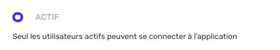

```js
{
 label: 'Billable to final customer',
 placeholder: 'billable to final customer',
 property: 'billableToCustomer',
 initialValue: {
   value: false
},
 className: 'is-12-mobile is-6-tablet is-3-widescreen no-label',
 inputType: InputType.Checkbox,
},
```

## Color picker

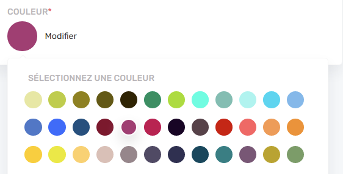

```js
{
  label: 'Color',
  property: 'color',
  inputType: InputType.ColorPicker,
  required: true
}
```

## Date picker

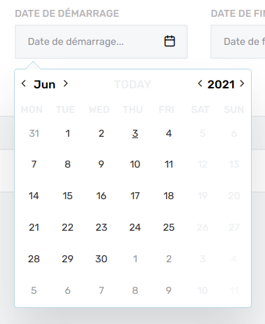

```js
  {
      label: `End date`,
      placeholder: `End date...`,
      property: 'endDate',
      inputType: InputType.Datepicker,
      required: true,
      helpText:
        'This data will appear on all contracts. Please make sure that you pass a correct value.'
    },
```

## Date range

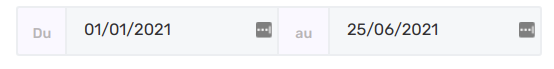

```js
 {
      label: `Dates`,
      properties: {
        dateFrom: 'startDate',
        dateTo: 'endDate'
      },
      inputType: InputType.DateRange,
      className: 'p-x-0-mobile is-6',
    }
```

## Email

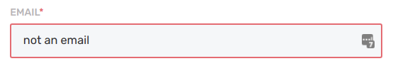

```js
{
  label: 'Billing email',
  placeholder: 'Billing email',
  property: 'billingEmail',
  inputType: InputType.Email
}
```

## File

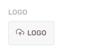

```js
    {
      label: 'File',
      placeholder: 'Choose a file',
      property: 'path',
      inputType: InputType.File,
      required: true
    }
```

## Image


```js
 {
      label: `Logo`,
      placeholder: `Logo`,
      property: 'logo',
      inputType: InputType.Image,
      className: 'is-4 p-x-0-mobile'
    }
```

## Multi search


Multi-search inputs work perfectly with resource relationships. They allow to search through several resources based on terms. [Read more about multi search](features/search.md)

```js
{
  id: 'userId',
  label: 'user',
  placeholder: `Choose a user...`,
  properties: {
    userId: 'userId'
  },
  retrievedItemProperties: {
    userId: 'user.id'
  },
  searchResources: [userDefinition],
  maxSelectedItems: 1,
  inputType: InputType.MultiSearch,
  className: 'is-6'
},
```

## Multi select

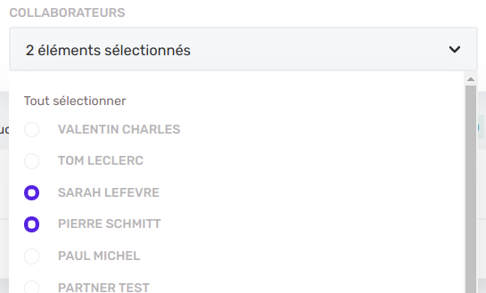

Multi-select fields works the same way as select inputs but let the user the possibility to chose several options instead of one.

```js
    {
      label: 'Users',
      property: 'userIds',
      placeholder: 'All',
      selectOptions: [{
        label: 'Label 1',
        value: 'Value 1'
      }, {
        label: 'Label 2',
        value: 'Value 2'
      }
      ],
      inputType: InputType.MultiSelect
    },
```

## Number

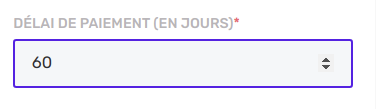

```js
{
  label: 'Days of work',
  property: 'daysOfWork',
  required: true,
  inputType: InputType.Number,
  min: 0,
  max: 100
}
```

## Password

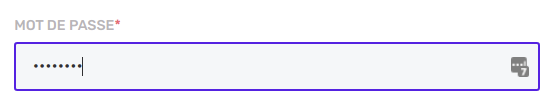

```js
{
  label: 'Password',
  property: 'password',
  inputType: InputType.Password,
  createValidators: [Validators.required],
  editValidators: []
}
```

## Radio

Comming soon...

```js

```

## Rich text


```js
{
  label: `Description`,
  placeholder: 'Description...'
  property: 'description',
  inputType: InputType.RichText,
  className: 'is-12 p-x-0-mobile'
}
```

## Select

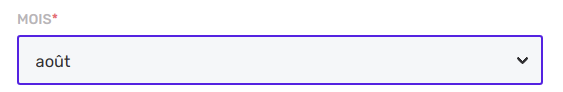

For select inputs, the options can be either synchronous or asynchronous. The `selectOptions` property of the field expects a function that returns either an array of **SelectOption** or a Promise of an array of **SelectOption**.

Let's start with a synchronous set of options. In that case we want the user to choose between 3 static options :

```js
 {
  label: 'What is you level in Typescript ?',
  property: 'codingLevel',
  inputType: InputType.Select,
  validators: [Validators.required],
  selectOptions: [
    {
      label: 'Beginner',
      value: 'beginner'
    },
    {
      label: 'Intermediate',
      value: 'intermediate'
    },
    {
      label: 'advanced',
      value: 'intermediate'
    }
  ],
  initialValue: {
    value: 'beginner'
  }
},
```

In other cases, you may prompt the user to choose between a list of dynamic resources. Let's say that we want to choose the project manager between all project managers registered. We can pass in `selectOptions` a function that will query the API and come back with the options.

The **ResourceService** has a `listSelectOptions` function that will add a `/select-options` at the end of the HTTP GET query and expect that the server return an array of **SelectOption**. You can even pass query params to filter the resources you will get.

```js
 {
      label: 'Project manager',
      property: 'projectManagerId',
      placeholder: 'Chose project manager...',
      required: true,
      selectOptions: [{
        label: 'Label 1',
        value: 'Value 1'
      }, {
        label: 'Label 2',
        value: 'Value 2'
      }
      ],
      inputType: InputType.Select
    },
```

If the selection of an option is optionnal, you can set the default option (with value equals empty string "") with the secondPlaceholder field:

```js
 {
      label: 'Project manager',
      property: 'projectManagerId',
      placeholder: 'Chose project manager...',
      secondPlaceholder: 'No project manager yet',
      required: false, // Optional
      selectOptions: [{
        label: 'Label 1',
        value: 'Value 1'
      }, {
        label: 'Label 2',
        value: 'Value 2'
      }
      ],
      inputType: InputType.Select
    },
```

## Tel

```js
{
  label: 'Phone number',
  property: 'phone',
  inputType: InputType.Tel,
}
```

## Text

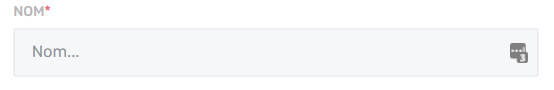

```js
{
  label: 'Name',
  property: 'name' ,
  inputType: InputType.Text
}
```

## Textarea

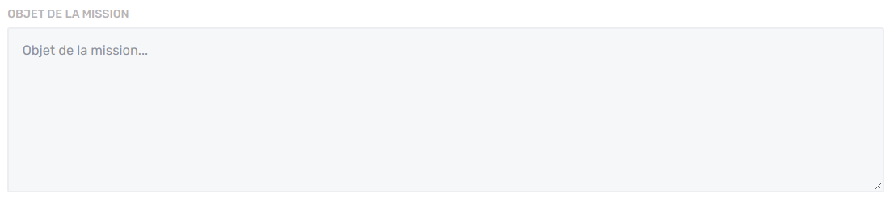

```js
{
  label: `Comments`,
  placeholder: 'Add your comments...'
  property: 'daysOfWork',
  inputType: InputType.Textarea,
  className: 'is-12 p-x-0-mobile'
}
```

## Time

Comming soon...

```js

```
