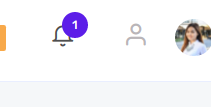

# Top menu quick links



You can add shortcuts to the top menu of CASE (desktop only). Of course you can decide who will see the icon based on [permissions](features/roles-and-permissions.md).

The topMenuLinks array is located on the `app.component.ts` file

```js
topMenuLinks: TopMenuLink[] = [
    {
        label: 'Go to user list',
        icon: 'icon-user',
        routePath: '/users',
        queryParams: {
            selectedTab: 'projects'
        },
        permissionsOr: ['browseUsers']
    }
]
```
