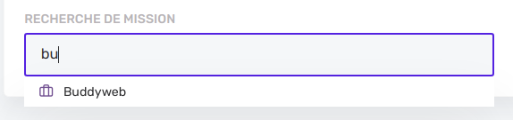

# Search



The [Multi search field](create-edit/field-types.md?id=multi-search) is a component that provides a simple way of searching and selecting one or several resources simultaneously. It is possible to search through different entities at the same time. Multi search inputs are widely used in [Create-edit Fields](../create-edit/field-types.md) and in [List filters](../list/filters.md)

## Make entities searchable

First of all, if you want to activate the search for an entity by adding some column names to the `searchableFields` array in your resource **entity** file. Let's say that we want to allow search for **users** somewhere in the app (in one or several views). This way we can allow search to be made on the `name`, `email` or `nickName`

```js
// user.entity.ts
@Entity({ name: 'users' })
export class User {
  public static searchableFields: string[] = ['name', 'email', 'nickName']
  public static displayName: string = 'name'
```

Then you can use Multi Search inputs as a field in create-edit views and as filters for list views.

### Create edit

```js
  fields: Field[] = [
    {
      id: 'userId',
      label: 'user',
      placeholder: `Choose a user...`,
      properties: {
        userIds: 'userIds'
      },
      retrievedItemProperties: {
        userIds: 'managerIds'
      },
      searchResources: [userDefinition],
      maxSelectedItems: 3,
      inputType: InputType.MultiSearch,
      className: 'is-6'
    }]
```

### List (as a filter)

When used in a list, we can choose which filter it will trigger by using the `properties` object: In that example, we are in a project list where we can filter by manager or by customer.

```js
  filters: Filter[] = [
    {
      label: 'Search project filtering by manager or by customer...',
      inputType: InputType.MultiSearch,
      searchResources: [userDefinition, customerDefinition],
      properties: {
        userIds: 'managerIds',
        customerIds: 'customerIds'
      }
    }
  ]
```

> [!TIP]
> For each resource definition that you pass, the MultiSearch input will emit an array of resources ids (`userIds` for `userDefinition` and `customerIds` for `customerDefinition`) that you can send as a query parameter in your GET HTTP request. For customers it is straightforward, but have a look at the `managerIds` part. Project managers are `User` entity items, but in order to make a HTTP request like `/projects?managerIds=2&managerIds=3` we need to add that line to pass from `userIds` to `managerIds`
