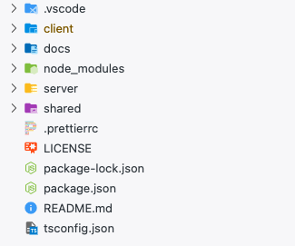
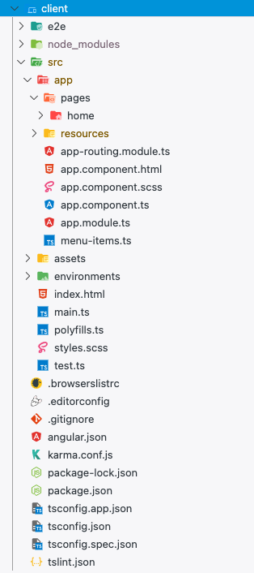
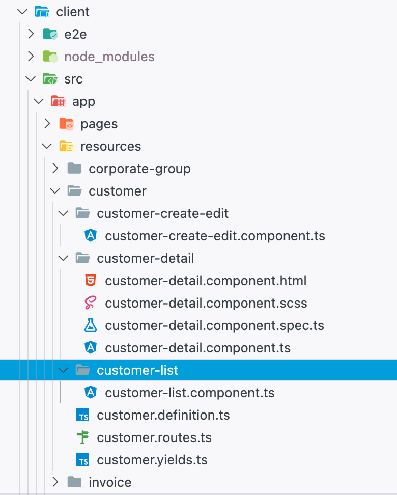
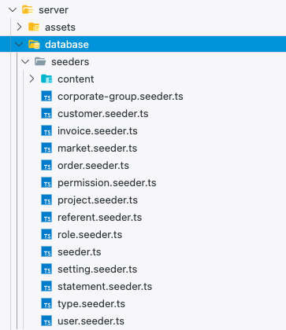
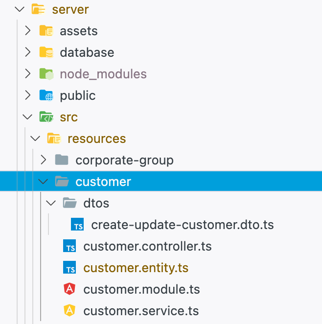
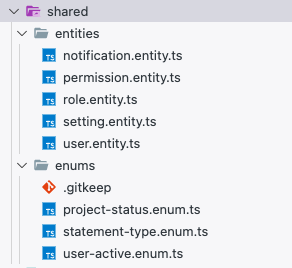

# Structure

CASE is using a monorepo structure.

The **client** and **server** directories, corresponding to the front and the back of the project, are stored in the same repository along with **shared** directory which contains files that are used in the both side such as Enums or Entities.

Let's have a look on what's happen when you create a new resource using the command line...

### Client

The **client** section is powered by [Angular](https://angular.io/docs), if you want to use the Angular CLI you need to be in this directory.
The **node_modules** folder come with Angular.
Into the **src** folder you will find a **app** folder with a **pages** and a **resources** folder.

When you create resource with the schematics cli, that create a new folder into the **resources** directory with all the basics files you need to work with. We strongly encourage you to navigate into it.

The **create-edit** folder contains file using to create or edit a resource from the front.

The **list** folder contains file using to list resource.

You can find futher explanations of the _.definition_ file in the [documentation here.](resources/resource-definitions.md).

> If you need a detail view for your resource, you will create the **detail** folder here.

### Server

The **server** part is powered by [NestJS](https://nestjs.com/), if you want to use the Angular CLI you need to be in this directory.

The **server** directory is containing two mains folders : **seeder** & **resources**.

The **database** folder contain a **seeder** folder where you will be able to seed dummy data using faker.

When you create a resource with the schematics cli, it will create a new folder into the **resources** directory with all the basics files you need to work with. We strongly encourage you to navigate into it. Such as the front you can have a look to the different files.
You can find further explanations of the _.entity_ file in the [documentation here](resources/entity-file.md).

### Shared

The shared directory contains files that can be use in the server and the client side such as _enums_ or _entities_.

### Directories aliases

To import files from the **shared** or **server** directory you can use theses aliases :

| Folder name | Folder alias |                                Example                                |
| :---------: | :----------: | :-------------------------------------------------------------------: |
|   server    |  `~server`   | `import { Nature } from "~server/src/resources/nature/nature.entity;` |
|   shared    |  `~shared`   | `import { ProjectStatus } from "~shared/enums/project-status.enum";`  |
