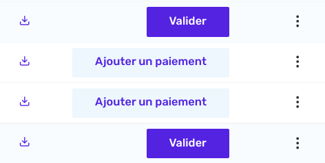

# Action buttons

- Front-end feature



Action buttons are buttons that are directly available from items on the list view. Clicking on those action buttons will trigger a [CASE Action](features/actions.md).

The `actionButtons` property is available in the [resource definition](/resources/resource-definitions.md) file.

This is a simple example with a `linkAction` that leads to the [detail page](/detail/detail.md) of the resource (an invoice in our case) :

```js
actionButtons: [
  {
    label: "See car detail",
    className: "button is-primary p-x-lg",
    permission: "readCars", // Only users with that permission will see the button.
    condition: (c: Car) => c.validated, // Prevent the button to appear on not validated cars.
    action: (car) => ({
      type: ActionType.Link,
      link: {
        path: `/cars/${car.id}`,
      },
    }),
  },
];
```
