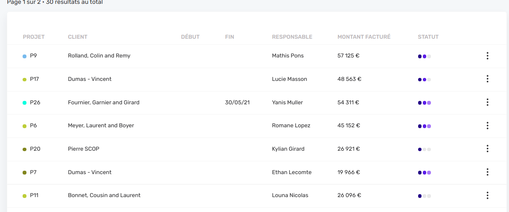

# Calculated columns



In a list view, it is possible to add new columns that correspond to a calculated or aggregated data rather than a real column in the database.

In the example image above, for each project we are showing **the sum of the amount of the project's invoices**.

## Adapting entity's own data

If the new column that you want to create is directly extracted from one of several columns in your [entity](../resources/entity-file.md), you can add TypeORM's `@afterLoad` decorator.

In the example below, we want to display the `amountWithTaxes` along with the `amount` but it would be redundant if we created 2 columns for both amounts. In a case where the taxes are **always** at 20% we would have this case :

```js
// invoice.entity.ts
  [...]

  @Column('int')
  amount: number

  amountWithTaxes: number

  @AfterLoad()
  public async afterLoad() {
    this.amountWithTaxes = this.amount * 1.2
  }
}
```

We could add an extra logic if we have international invoices where taxes are not applied:

```js
// invoice.entity.ts
  [...]

  @Column('tinyint')
  isInternational: boolean


  @Column('int')
  amount: number

  amountWithTaxes: number

  @AfterLoad()
  public async afterLoad() {
    this.amountWithTaxes = this.isInternational ? this.amount : this.amount * 1.2
  }
}
```

# Insert calculated relationship data

If you need to get relationship data and then apply logic on it, then the `transformResult` param the `PaginatorService.paginate()` function is the way to go.

This property accepts a function that takes the queried item as parameter and returns the same thing (obviously will your additions. If you will include asynchronous code, You can use the `asyncTransformResult` property instead.

```js
// project.service.ts (server)
[...]
projectRepository
.createQueryBuilder('project')
.leftJoinAndSelect('project.invoices', 'invoice')
.leftJoinAndSelect('project.accountManager', 'accountManager')
.leftJoinAndSelect('project.leadDeveloper', 'leadDeveloper')
[...]

return this.paginationService.paginate({
  query,
  currentPage: page ? parseInt(page, 10) : 1,
  transformResult: (p: Project) => {
    // Calculate sum of project invoices amount.
    p.totalInvoiceAmounts = p.invoices.reduce((sum, i) => sum + i.amount, 0);

    // Other example with invoices and highlight specific items: shows warning is one invoice is late.
    p.isWarningHighlight = p.invoices.some(i => i.isLate)

    // Create an array of composite data to display in the same image yield.
    p.teamImages = [
      {
        label: project.accountManager.name,
        image: project.accountManager.image,
      },
      {
        label: project.leadDeveloper.name,
        image: project.leadDeveloper.image,
      },
    ];

    return p;
  },
});
```

> [!ATTENTION]
> Only results displayed in the page are transformed, not the full list. This means that the performance can be acceptable even if you have long queries. However you will not be able to sort by a column calculated this way. You will need [disable orderby](../list/yields.md) on that column.
