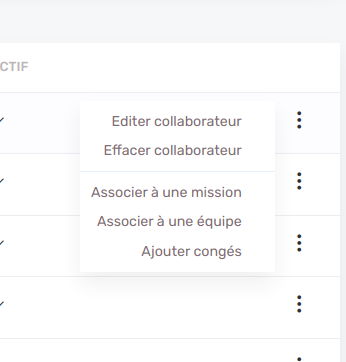

# Dropdown links



Dropdown links appear in a dropdown menu on [list view](list/list.md) for each item. Each link can or cannot appear based on different logic: current user [permission](features/roles-and-permissions.md) or a condition for each item.

An [Action](features/actions.md) is triggered on click.

You can _disabled_ a dropdown item based on a condition, it will appear but will not be clickable.

By giving a string to the property _tooltip_ a tooltip will appear on hover.

```js
dropdownLinks: [
  {
    label: 'Editer collaborateur',
    permission: 'editUsers',
    condition: (user: User) => user.isActive,
    action: (user: User) => ({
      type: ActionType.Link,
      link: {
        path: `${userDefinition.path}/${user.id}/edit`
      }
    })
  },
  {
    label: 'Effacer collaborateur',
    permission: 'deleteUsers',
    withDivision: true,
    action: (user: User) => ({
      type: ActionType.Delete,
      delete: {
        itemToDelete: user,
        definition: userDefinition
      }
    }),
    disabled: (user: User) => user.projects.length || user.isActive,
    tooltip: (user: User) =>
      user.projects.length
        ? 'Vous ne pouvez supprimer un collaborateur relié à des projets.'
        : null || user.isActive
        ? 'Vous ne pouvez supprimer un collaborateur relié actuellement en activité.'
        : null
  }
]
```
