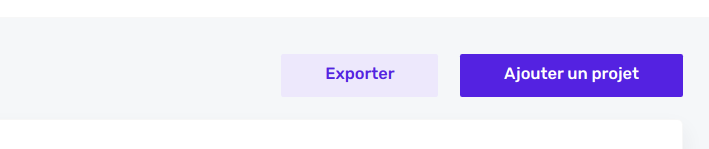
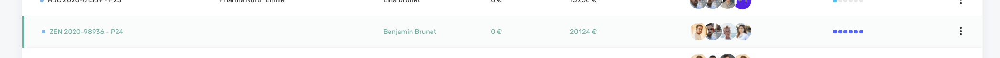

# List view

A list view is a view where you present a list of resources.

The list view is divided in different parts :

- The header with the title and eventually a link to create a new resource
- [The filters](list/filters.md) that help users to find the correct content
- [The key numbers](list/../key-numbers.md) that give you quick insights about the data you are consulting, usually totals or sums
- The table with the data columns containing [the yields](list/yields.md) or [the action buttons](list/action-buttons.md)
- The pagination

## Top buttons



You can add 2 types of buttons on top of the list :

- Create a new resource button
- Export current list button

This setting is made in the `buttons` property of the [Resource definition](resources/resource-definitions.md) file :

```js
  buttons: [LinkType.CREATE, LinkType.EXPORT],
```

By default, only the "create" button is here but you can add the "export" one too.

## Highlighting specific items



You can highlight specific items on the list to make an emphasis on something: an unpaid invoice with a red background, active projects in green, etc.

The lines will take conditional classes based on the properties of the objects themselves. A user with a `isDangerHighlight: true` property will appear in green for example. Here are the different classes (based on Bulma's) and the property name that must be set to `true` :

```js
 'is-danger': myItem.isDangerHighlight,
 'is-warning': myItem.isWarningHighlight,
 'is-info': myItem.isInfoHighlight,
 'is-success': myItem.isSuccessHighlight,
 'is-disabled': myItem.isDisabledHighlight
```

## Export list into an Excel file

The resource definition file specifies the buttons that will appear in the list. Adding the `LinkType.Export` will add the "export" button.

```js
// my-resource.definition.ts (client).
buttons: [LinkType.CREATE, LinkType.EXPORT],
```

Clicking on the export button will trigger an HTTP GET query with a `?toXLS=true` query param to the server. We expect a JSON response as the following:

```js
{
  filePath: 'relative-file-path.xls'
}
```

In the server, we can use the **ExcelService** to generate an export. The **export()**
function takes 3 parameters, an array with the column headings, and array of arrays with the desired values to display in the columns, and the name of the resource that will be used for the file name.1

```js
// my-resource.service.ts (server).
  constructor(
    [...],
    @Inject(ExcelService) private readonly excelService: ExcelService
  ) {}

 // The export function should be called if the toXLS param equals to "true".
  async export(query: SelectQueryBuilder<User>) {
    const users = await query.getMany()
    return this.excelService.export(
      ['Nom et prénom', 'E-mail', 'Hourly rate'],
      users.map((u: User) => [
        u.name,
        u.email,
        u.hourlyRate,
      ]),
      'users'
    )
  }
```
