# Yield types

## Address

Displays an Address an links to the location on Google Maps on click.

```js
{
  label: 'Address',
  property: 'address',
  type: YieldType.Address
},
```

## Currency

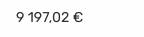

Formats a number into a currency-formatted string (euros only).

```js
{
  label: 'Budget',
  tooltip: 'Total project budget',
  property: 'budgetAmount',
  type: YieldType.Currency
},
```

## Check

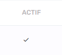

A simple "check" icon that appears for items where the property given is truthy.

```js
{
  label: 'Actif',
  property: 'isActive',
  type: YieldType.Check
},
```

## Color

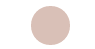
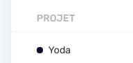

Displays a color circle based on a Hexadecimal color string.

It is possible to display another property in the same yield next to a small circle of a color. Example : Displaying a project name with a circle of the color of its type.

```js
 {
   label: '',
   property: 'color',
   type: YieldType.Color,
   width: 50
 },
 {
   label: 'Project',
   className: 'has-mini-circle',
   property: 'department.color',
   secondProperty: 'label',
   orderByProperty: 'name',
   type: YieldType.Color,
   link: (project: Project) => `projects/${project.id}`
 },
```

## Date

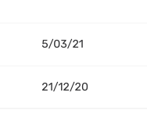

Converts a JS Date() into a nice DD/MM/YYYY element.

```js
{
  label: 'End',
  property: 'endDate',
  type: YieldType.Date
}
```

## Download


Displays a download link that forces download of a static file situated in the storagePath (`client/src/environments/environment.ts` file). Example: `/invoices/Jun2021/F358-ACME.pdf`.

```js
{
   label: 'Download in PDF',
   property: 'path',
   type: YieldType.Download
 }
```

## Icon

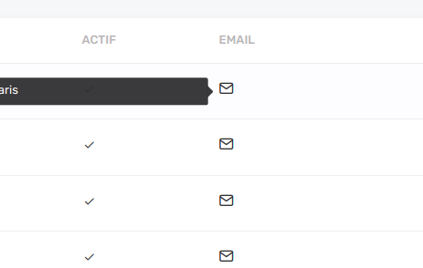

A conditional icon that appears only when the property is truthy. The property content is display on a tooltip on mouse over the icon. Icons can be chosen in [Feather icons](https://feathericons.com/) set.

```js
{
  label: 'email',
  property: 'emailContent',
  icon: 'icon-email'
  type: YieldType.Icon
},
```

## Icon (file)

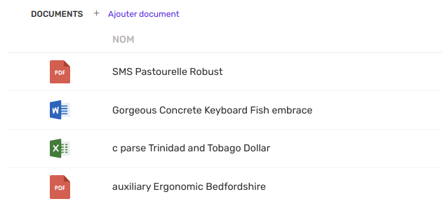

A icon to display an icon based on the extension of the file name. As of today it works with Excel files, PowerPoint, Word and PDF files. Other files will be displayed with a generic file icon.

```js
{
  label: '',
  property: 'path',
  type: YieldType.FileIcon
},
```

## Image

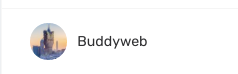
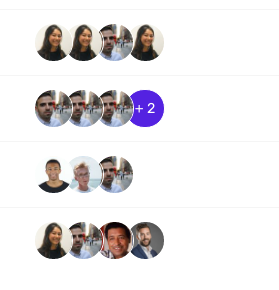

There's several options of displaying image.

The CASE Yield Image can takes two input as properties :

- `label` which referes to the text you may want to display next to the image
- `imageObjects` which takes the following arguments

```
imageObjects: {
    image: string
    title?: string
    tooltip?: string
    link?: { path?: string; queryParams?: {} }
  }[]
label: string
```

`imageObjects` is an array so you can display one or several image(s) with the many options you have.

The title property will be us as title and alt img attribute.
The tooltip will appear on mouse over an image.
The link object redirect to the routerLink for the path property or to the queryParams for the queryParams property.

```js
[
  {
    // Data that we expect to receive from API.
    label: "John Doe",
    image: "users/Feb2021/173hkcaq18kkr89tmw",
  },
];
```

```js
{
  label: 'Client',
  property: 'imageObjects',
  secondProperty: 'name',
  orderByProperty: 'name',
  type: YieldType.Image
}
```

## Number

Basic number formatter to display numbers (uses Angular "number" pipe behind the scenes).

```js
{
  label: 'Project count',
  type: YieldType.Number
},
```

## Progress bar

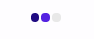

The progress bar requires 3 properties :

- property: the current status in number (ex: 2)
- secondProperty: the number of all options of the progress bar (ex: 5)
- thirdProperty: the current status in string that will appear on mouse over (ex: "Pending validation")

```js
{
   label: 'Project Status',
   property: 'statusNumber',
   secondProperty: 'totalStatusNumber',
   thirdProperty: 'statusInString',
   type: YieldType.ProgressBar
 }
```

## Progress bar (analog)

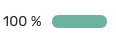

The analog progress bar displays visually a percentage. The property value has to be a numerical value between 0 and 1.

```js
{
   label: 'Payment percentage',
   property: 'paymentPercentage',
   type: YieldType.Download
 }
```

## Switch

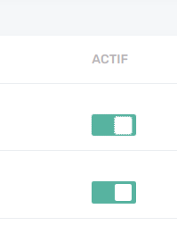

The switch yield does more than display values. It let's you interact with your data through [the action system](features/actions.md). It this action is successful, the switch will move to the opposite direction.

It is also possible to display another textual value after the switch passing a prop name into `secondProperty`.

```js
{
  label: 'Actif',
  property: 'isActive',
  type: YieldType.Switch,
  action: (user: User) => ({
    type: ActionType.Patch,
    patch: {
      path: `/users/${user.id}/toggle-active`,
      successMessage: 'User status has been changed',
      errorMessage: 'Error : could not change user status'
    }
  })
}
```

## Text

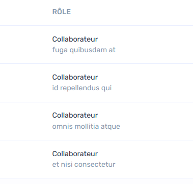

The default yield if you do not specify a `type` is a simple text. You can pass a second argument to display a second text below.

```js
{
  label: 'Rôle',
  property: 'role.displayName',
  secondProperty: 'objective'
},
```
