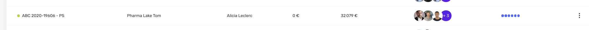
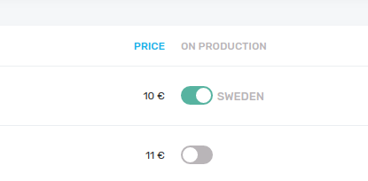

# Yields

- Front-end feature



On [list views](./list.md), it is possible chose the information to display on table columns.

On creating a resource, a `$resource$.yields.ts` is created and contains the list of the yields for the resource. You can add your own **Yields** based on your resources properties. Make sure that each property is returned by the API.

```js
import { Yield, YieldType } from 'case'

export const catYields: Yield[] = [
  {
    label: 'name',
    property: 'name'
  },
  {
    label: 'amount',
    property: 'amount',
    type: YieldType.Currency
  },
  {
    label: 'status',
    property: 'status',
    secondProperty: 'maxStatus',
    thirdProperty: 'statusInString',
    type: YieldType.ProgressBar
  }
]
```

## Yield extra options

### Link

Each yield links by default to the DEFAULT LINK of the item. However, you can link to a specific resource page if you specify it.

```js
{
  label: 'Customer',
  property: 'customer.label',
  link: (project: Project) => `customer/${project.customer.id}` // Link to the project's customer detail page.
},
```

### Order

By default if you click on the column header it will reload the list adding an `orderBy` query param in the HTTP GET request. One more click and it will add an `orderByDesc=true` query param. Of course your controller has to accept those query parameters and adapt the response to make sorting effective.

If you want to disable the click to order on a column, just set the `disableOrderBy` prop to `true` :

```js
{
  label: 'Customer',
  property: 'customer.label',
  disableOrderBy: true
},
```

In some cases, you may want to orderBy a different property on click :

```js
{
  label: 'Project',
  property: 'label' // Maybe a computed label that does not exist in DB.
  orderByProperty: 'name',
  type: YieldType.Color
},
```

### Style

You can tweak with styling to arrange the display of the column :

```js
{
  label: 'Views',
  width: 50, // With in px. Accepts string with percentage too: Ex: "40%".
  className: 'my-custom-class', // TD tag class.
  headingClassName: 'is-info', // TH tag class.
  property: 'video.views',
  type: YieldType.Number
},
```


