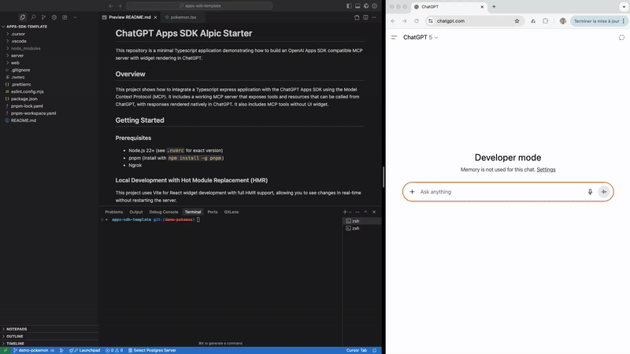

# ChatGPT Apps SDK Alpic Starter

This repository is a minimal Typescript application demonstrating how to build an OpenAI Apps SDK compatible MCP server with widget rendering in ChatGPT.



## Overview

This project shows how to integrate a Typescript express application with the ChatGPT Apps SDK using the Model Context Protocol (MCP). It includes a working MCP server that exposes tools and resources that can be called from ChatGPT, with responses rendered natively in ChatGPT. It also includes MCP tools without UI widgets.

## Getting Started

### Prerequisites

- Node.js 22+ (see `.nvmrc` for exact version)
- pnpm (install with `npm install -g pnpm`)
- Ngrok

### Local Development with Hot Module Replacement (HMR)

This project uses Vite for React widget development with full HMR support, allowing you to see changes in real-time, directly within ChatGPT conversation, without restarting the server.

#### 1. Clone and Install

```bash
git clone <repository-url>
cd apps-sdk-template
pnpm install
```

#### 2. Start the Development Server

Run the development server from the root directory:

```bash
pnpm dev
```

This command starts an Express server on port 3000. This server packages:

- an MCP endpoint on `/mcp` - aka the ChatGPT App Backend
- a React application on Vite HMR dev server - aka the ChatGPT App Frontend

#### 3. Expose Your Local Server

In a separate terminal, expose your local server using ngrok:

```bash
ngrok http 3000
```

Copy the forwarding URL from ngrok output:

```bash
Forwarding     https://3785c5ddc4b6.ngrok-free.app -> http://localhost:3000
```

#### 4. Connect to ChatGPT

- Enable **Settings → Connectors → Advanced → Developer mode** in the ChatGPT client
- Navigate to **Settings → Connectors → Create**
- Enter your ngrok URL with the `/mcp` path (e.g., `https://3785c5ddc4b6.ngrok-free.app/mcp`)
- Click **Create**

#### 5. Test Your Integration

- Start a new conversation in ChatGPT
- Select your newly created connector using **the + button → Your connector**
- Try prompting the model (e.g., "Show me pikachu details")

#### 6. Develop with HMR

Now you can edit React components in `web` and see changes instantly:

- Make changes to any component
- Save the file
- The widget will automatically update in ChatGPT without refreshing or reconnecting
- The Express server and MCP server continue running without interruption

**Note:** When you modify widget components, changes will be reflected immediately. If you modify MCP server code (in `src/`), you may need to reload your connector in **Settings → Connectors → [Your connector] → Reload**.

## Widget Naming Convention

**Important:** For a widget to work properly, the name of the endpoint in your MCP server must match the file name of the corresponding React component in `web/src/widgets/`.

For example:

- If you create a widget endpoint named `pokemon-card`, you must create a corresponding React component file at `web/src/widgets/pokemon-card.tsx`
- The endpoint name and the widget file name (without the `.tsx` extension) must be identical

This naming convention allows the system to automatically map widget requests to their corresponding React components.

## Deploy to Production

Use Alpic to deploy your OpenAI App to production.

[](https://app.alpic.ai/new/clone?repositoryUrl=https%3A%2F%2Fgithub.com%2Falpic-ai%2Fapps-sdk-template)

- In ChatGPT, navigate to **Settings → Connectors → Create** and add your MCP server URL (e.g., `https://your-app-name.alpic.live`)

## Project Structure

```
.
├── server/
│   ├── app.ts          # OpenAI App extension class with widget API implementation
│   ├── server.ts       # MCP server with tool/resource/prompt registration
│   └── index.ts        # Express server definition
└── web/
    └── src/
        └── widgets/    # React widget components (must match endpoint names)
```

## Resources

- [Apps SDK Documentation](https://developers.openai.com/apps-sdk)
- [Model Context Protocol Documentation](https://modelcontextprotocol.io/)
- [Alpic Documentation](https://docs.alpic.ai/)
